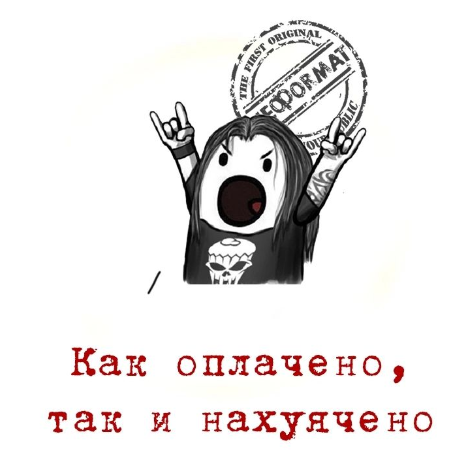

<h1 style="color: #73C6B6"> Портал ВСіЗК</h1>
Мета: отримання інформації в пару кліків

<h3 style="color: #FFF4B5">Проксі база даних</h3>

Суть ідеї в тому, щоб створити окрему базу даних для порталу, яка буде через адмінку синхронізуватись з основною базою та можна буде додавати додаткові позиції, яких не буде в основній базі.
Основна база буде дуже загруженою як по кількості елементів так і запитів. Тому в неї будуть додавати мінімально необхідний набір продукції (ходові товари).
Тому проксі база буде містити тільки продукти для порталу + необхідні додаткові, які не включені в основну

**cons**

    - додаткова база, додаткове обслуговування
    - необхідна адмінка
    - необхідно десь зберігати зображення та файли

**pros**

    - незалежна база, яка актуалізується з основною
    - не навантажується основна база
    - можливість створення додаткових елементів для порталу,  не обтяжуючи основну

<h3 style="color: #FFF4B5">Адмінка порталу</h3>

функціонал:

- додавання нових елементів
- синхронізація з основною базою даних (якщо не буде автоматичного)

<h3 style="color: #FFF4B5">Конфігуратор/сервіс по шафам</h3>

необхудно:

- визначити основну ідею та функціонал
- під якого виробника шаф (ETA, ELDON, КУБ)
- інтеграція з основною базою даних

<h3 style="color: #FFF4B5">Карта/и продукції</h3>

суть ідеї - візуальне відображення продукції по вибраному принципу з коротким описом

що дає - швидке та легке відображення основних типів продукції певної лінійки. Легке розуміння, що в нас є і що можна розглянути як альтернативу

<h3 style="color: #FFF4B5">Інтеграція логотипу</h3>

